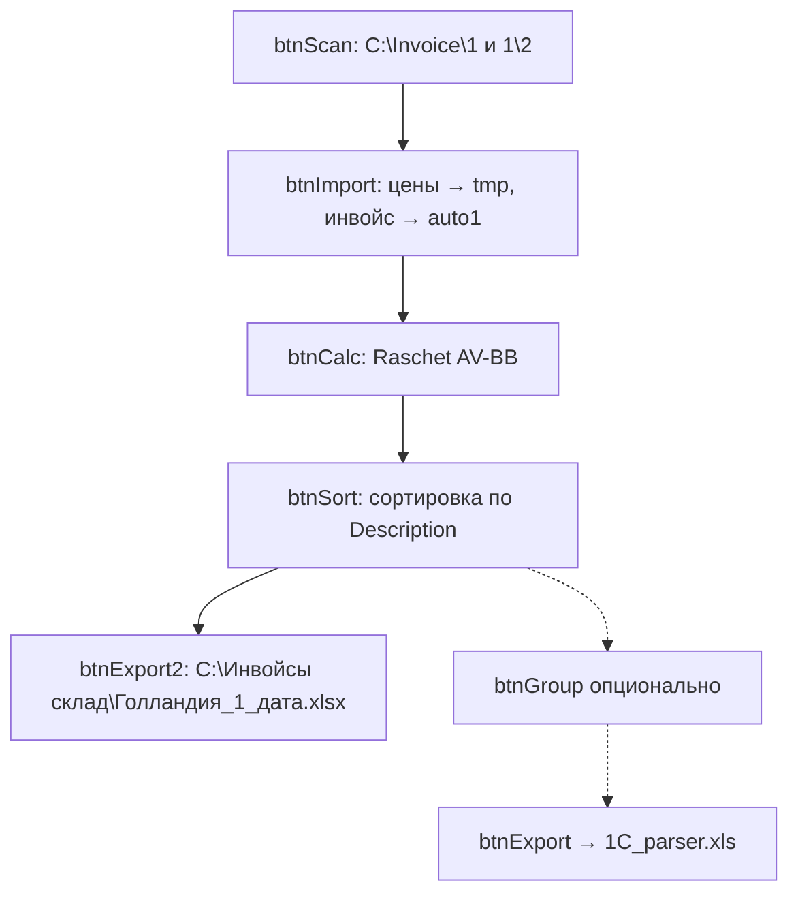

# Auto_new.xls — лист `auto1`: кнопки и макросы

Документ по **реальному VBA** из `Invoice/auto_new-vba.txt` (экспорт `olevba` с Windows-сервера).

Кодовое имя листа в VBA: **`Лист1`** = лист **`auto1`** в книге.

---

## Последовательность кнопок (как в работе)

| Шаг | Кнопка в UI | Макрос | После шага включится |
|-----|-------------|--------|----------------------|
| 1 | **Scan** | `btnScan_Click` | `btnImport` |
| 2 | **1. import invoice** | `btnImport_Click` | `btnCalc` |
| 3 | **2. calculate** | `btnCalc_Click` | `btnSort` |
| 4 | **3. sort** | `btnSort_Click` | `btnGroup`, **`btnExport2`** |
| 5 | **for sklad** | **`btnExport2_Click`** | (экспорт завершён, кнопки export выкл.) |

Дополнительно (не в вашей короткой цепочке, но в книге):

| Кнопка | Макрос | Назначение |
|--------|--------|------------|
| **Group** (после sort) | `btnGroup_Click` | Схлопывает строки с одинаковым артикулом, пересчитывает кол-во и цену |
| **Export** (другая) | `btnExport_Click` | Выгрузка в **`C:\Invoice\1C_parser.xls`** (парсер 1С) |

При открытии книги (`Workbook_Open`) активны только **Import**; остальные кнопки выключены.

---

## Папки и элементы UI

| Элемент | Путь / значение |
|---------|-----------------|
| `cmbInvoices1` | Список файлов из **`C:\Invoice\1\`** |
| `cmbInvoices2` | Список файлов из **`C:\Invoice\1\2\`** (файл **цен**, должен быть **один**) |
| Scan | `ЗагрузкаСпискаФайлов` с глубиной поиска 1 |
| Import | Основной инвойс: `GetObject("C:\Invoice\1\" & cmbInvoices1.Value)` |
| Цены | `GetObject("C:\Invoice\1\2\" & cmbInvoices2.Value)` → копия на лист **`tmp`** |

Если в `C:\Invoice\1\2\` больше одного файла — сообщение *«В папке 2 более 1 файла с ценами !!!»* и **Import блокируется**.

---

## 1. Scan — `btnScan_Click`

```vba
cmbInvoices1.Clear
Call ЗагрузкаСпискаФайлов("C:\Invoice\1", 1)      ' → combo на auto1
cmbInvoices2.Clear
Call ЗагрузкаСпискаФайлов("C:\Invoice\1\2", 4)   ' → cmbInvoices2 на auto1
```

- Рекурсивный обход папки (`FilenamesCollection` / FSO), маска `*.*`.
- Первый файл в списке выбирается автоматически (`ListIndex = 0`).
- Включает кнопку **Import**.

---

## 2. Import invoice — `btnImport_Click`

### Подготовка

- `offset_Y = 7` (данные с **строки 8**).
- `ActualCurs1` — курс в **`AW3`** с листа **`Расчет курса перевода`** (последняя непустая ячейка в колонке D).

### Шаг A — файл цен → `tmp`

1. Очистка `tmp!A1:BM500`.
2. Открытие **`C:\Invoice\1\2\<cmbInvoices2>`** без UI (`GetObject`).
3. Копирование `A1:AW500` → `tmp`.
4. `UnMerge`, поиск маркера **`FC`** в колонке A, trim строк.
5. Закрытие файла цен.

### Шаг B — инвойс → `auto1`

1. Очистка `auto1!A7:BB500`.
2. Если выбран `cmbInvoices1`:
   - Открытие **`C:\Invoice\1\<cmbInvoices1>`**.
   - `FindOffset` — ищет ячейку вида **`Box*`** (строка заголовка таблицы).
   - Копирование `A<offset>:AW500` → `auto1` с строки 7.
   - Перестановка колонок: `L→G`, `O→L` (подгонка формата инвойса).
   - Очистка `Q7:V500`.
   - Для «новых» форматов: перенос колонок AV/AW из исходного файла в AU, очистка AV/AW на auto1.
3. `FindAllCols` — по заголовкам находит буквы колонок (`Box`, `Quant`, `Description`, `S1`, `S2`, `Packing`…).
4. Включает **Calculate**.

**Цены в расчёте:** колонки **P** (Price) и **Q** (Overall) на auto1; справочник цен — **`tmp`**, сопоставление по **Description (кол. F)**.

---

## 3. Calculate — `btnCalc_Click`

```vba
Call Raschet(offset_Y + 1, last_row)
' для строк где Article Like "Ros*": дописывает S1 к артикулу
```

### `Raschet` — основные формулы (локальные, `FormulaLocal`)

Пусть `start = 8`, `EUR1` = кол. **P** (Price), `EUR2` = кол. **Q** (Overall), курс в **`$AW$3`**.

| Колонка | Заголовок | Формула (смысл) |
|---------|-----------|-----------------|
| P | Price | `=ВПР(F8;'tmp'!$A$1:$H$500;8;0)` — цена из tmp по Description |
| B | Kolli | копия из tmp по совпадению F (цикл) |
| Z | — | `=ВПР(O8;'tmp'!$A$1:$H$500;8;0)` — доп. поле по Packing |
| Q | Overall | `=P8*D8` (Quant) |
| AV | Цена 1 шт. | `=P8*$AW$3` |
| AW | Цена упаковки | `=Q8*$AW$3` |
| AX | Стоимость доставки | `=ВПР(O8;'Расчет доставки'!$A$5:$F$200;6;0)+Z8*$AW$3` |
| AY | Сумма в коробке | `=СУММ($AW$start:$AW$end)` внутри одного Box nr. (`FillKorobki`) |
| AZ | Коэффициент | `=AX8/AY8+1` |
| BA | Себестоимость 1 шт. | `=AV8*AZ8` |
| BB | КОЭФФ×Себестоимость | `=BA8*koeff`, где `koeff = (AW3 * Int(Расчет доставки!J18) / сумма(Quant*BA)) + 1` |

`FillKorobki` — для одинакового **Box nr.** суммирует AW в AY и рисует верхнюю границу коробки.

После расчёта включается **Sort**.

---

## 4. Sort — `btnSort_Click`

1. Колонки **AV:BB** и **P:Q** → копия → **значения** (убрать формулы).
2. `Sortirovka` — сортировка всего блока **A:BB** по колонке **Description** (восходящая).
3. Подсветка и служебные поля для **подряд идущих одинаковых** Description (цвет, колонки справа от Article — индексы +15, +16 для сумм).
4. Включаются **Group** и **Export2** (for sklad).

---

## 5. For sklad — `btnExport2_Click`

**Это кнопка «for sklad»** в вашей цепочке.

1. `Sortirovka2` — доп. сортировка перед выгрузкой.
2. Новая книга → сохранение:

   **`C:\Инвойсы склад\Голландия_1_<дата>.xlsx`**

   (в коде закомментирован вариант `D:\Склад ОБмен\Инвойсы Склад\...`)

3. Копируются колонки: Box, Packing, Quant, Description, B (Kolli), S1, S2, s4, Cnt — в колонки A–I новой книги.
4. Чекбоксы в столбце экспорта (визуальная разметка).
5. Вторая копия: **`C:\Invoice\1\copy\copy_Голландия_1_<дата>.xlsx`** (артикул, Kolli, S1).

На листе **auto2** (`Лист4`) `btnExport2` копирует файл в **`D:\Склад ОБмен\Инвойсы Склад\<страна>_<дата>.xls`** — другая ветка, не auto1.

---

## Export в 1С — `btnExport_Click` (не «for sklad»)

- Открывает **`C:\Invoice\1C_parser.xls`**.
- Дописывает строки на лист **Лист1** парсера: A–I (поля товара), **T** = BB (итоговая цена), **E1** = курс AW3.
- Формулы на парсере: `U = T*C`, `V = (T - J*$E$1)/T + 1`.
- Сохраняет парсер.

Включается после **Group** (или вместе с Export2).

---

## Group — `btnGroup_Click` (опционально между sort и export)

- Находит строки с одинаковым кодом группы (кол. Article+3).
- Суммирует кол-во и цену в первую строку группы, остальные помечает `del` и **удаляет**.
- Пересчитывает BB и Quant в объединённой строке.
- Включает **btnExport** и **btnExport2**.

---

## Вспомогательные процедуры

| Процедура | Назначение |
|-----------|------------|
| `FindOffset` | Строка заголовка по ячейке `Box*` |
| `FindAllCols` | Индексы/буквы колонок по ключевым словам в строке 7 |
| `ActualCurs1` / `ActualCurs2` | Курс в AW3 с «Расчет курса перевода» |
| `LastCell` | Последняя непустая строка |
| `ЗагрузкаСпискаФайлов` | Список файлов в combo |
| `UbratLishnee` | Удаление мусорных строк (закомментировано в calc) |

---

## Связь с cvetopt

| Процесс cvetopt | Связь с auto1 |
|-----------------|---------------|
| Почта → `data/downloads/mail/1/` | Файлы должны попадать в **`C:\Invoice\1\`** (или аналог), затем **Scan** |
| `balance_auto` / лист «АВБ перелеты» | **Отдельный** сценарий, не эти макросы |
| Эквадор Biflorica | Отдельный `.xlsm`, не auto1 |

**Важно:** запись в `Auto_new.xls` через **xlwt** удаляет VBA. Сохранять только через Excel (**xlwings**, `excel_engine: auto`).

---

## Диаграмма



---

## Файл с исходником VBA

Полный дамп: [`Invoice/auto_new-vba.txt`](../Invoice/auto_new-vba.txt) (~2200 строк).

Модули: `ЭтаКнига`, `Лист1` (auto1), `Лист4` (auto2), `Module1`, и др.

*Обновлено по VBA с сервера: 2026-06-04.*
