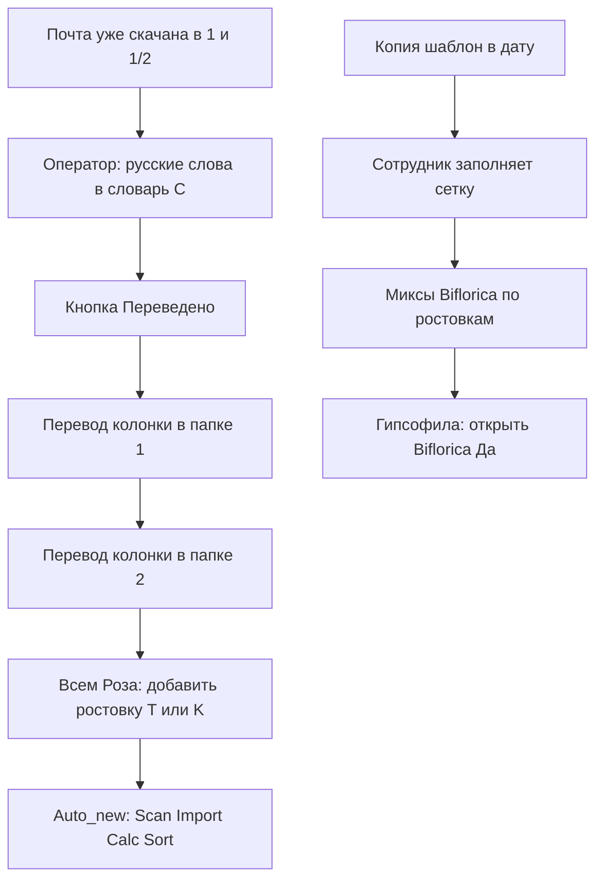

# ТЗ: дельта по созвону 31.07.2026

## Метаданные

| Поле | Значение |
|------|----------|
| Дата созвона | 31.07.2026, ~10:35 (Телемост) |
| Источник | [`Встреча в Телемосте 31.07.26 10-35-13 — запись.webm`](Встреча%20в%20Телемосте%2031.07.26%2010-35-13%20—%20запись.webm) |
| Транскрипт | [`transcript_31.07.2026.txt`](transcript_31.07.2026.txt) (faster-whisper medium, ru) |
| Доп. источник | Текстовые шаги 1–10 от 30.08.2026 (уточнение колонок) |
| Статус | draft из автотранскрипции + сверка с кодом |
| Scope | **только новое / изменённое** относительно текущего cvetopt |

В транскрипте Whisper местами путает термины (`screen`→Scan, `автоньюз`→Auto_new, `растворка`/`расторга`→ростовка, `s1`→длина/цена). Ниже — восстановленный смысл; спорные места помечены `[?]` и таймкодом.

---

## 1. Цель

Довести цепочку после ручного перевода словаря до склада: перевести **два** почтовых Excel, проставить **ростовку** у всех роз, прогнать Auto_new до Sort, затем (отдельный сценарий) из заполненного сотрудником **шаблона** разложить миксы Biflorica по сортам/длинам и отделить гипсофилу.

---

## 2. Новые / изменённые требования

### 2.1 UI и сценарии запуска

| ID | Требование | Таймкод | Статус vs код |
|----|------------|---------|---------------|
| UI-1 | Новая кнопка **«Переведено»** / **«Продолжить далее»**: после того как оператор вручную заполнил русские переводы в словаре (колонка C), программа продолжает работу | [00:29]–[02:59] | **Новое.** Сейчас «Перевод (только)» переводит `Голландия_1_*` на складе, а не файлы в папках 1/2 |
| UI-2 | Ещё одна кнопка (или шаг цепочки) для: копия «шаблон» → дата + разбор миксов Biflorica + Гипсофила | [15:36], [17:27], [27:51] | **Новое** |
| UI-3 | Порядок после «Переведено»: перевод 1+2 → ростовка у роз → Auto_new Scan→Import→Calculate→Sort (Group **не** жать) | [03:06]–[07:19], [13:14]–[15:24] | Частично: auto1 уже есть, но **цепочка и входные файлы другие** |

Рекомендуемая раскладка кнопок (из созвона + 30.08):

1. **«Переведено»** — шаги 2.2 + 2.3 (+ опционально auto1 до Sort).
2. **«Миксы / шаблон»** (название уточнить) — шаги 2.4–2.6.

---

### 2.2 Перевод двух файлов (изменение)

**Было (сейчас):** перевод Description в `Голландия_1_*.xlsx` из папки «Инвойсы склад» по `Словарь.xls` (B→C).

**Нужно (дельта):**

1. Оператор вручную дописывает русские значения в словарь для новых английских слов (словарь уже умеет дописывать EN в B с пустым C — это уже есть).
2. По кнопке **«Переведено»** программа:
   - открывает файл в **папке 1** (`C:\Invoice\1`, инвойс с почты);
   - переводит **всю целевую колонку наименований** по словарю;
   - открывает файл в **папке 2** (`C:\Invoice\1\2`, файл цен);
   - переводит ту же смысловую колонку, чтобы оба файла были на русском одинаково.
3. Переводится **только колонка наименования/описания**, не весь лист. [02:46]–[02:59]

| Вопрос | Решение из созвона / 30.08 |
|--------|----------------------------|
| Какие файлы | Один файл в папке 1 + один в папке 2 (как после скачивания с почты) |
| Какая колонка | Колонка с названием сорта/описанием (в папке 2 это колонка **F** при правке ростовки — см. 2.3) `[?]` точное имя заголовка проверить на сервере |

---

### 2.3 Ростовка у всех роз (замена логики сравнения цен)

На созвоне сначала обсуждали сравнение цен после Sort ([07:37]–[11:28]), затем **упростили** ([13:14]–[15:24]): не сравнивать цены в Auto_new и не ходить в Group — сразу после перевода дописать ростовку **всем** розам в исходных файлах.

**Итоговая логика (актуальная):**

После перевода файлов в папках 1 и 2:

| Папка | Условие строки | Куда писать | Что добавить |
|-------|----------------|-------------|--------------|
| `C:\Invoice\1` | в наименовании есть слово **«Роза»** (после перевода — на русском) | к наименованию (колонка имени; по 30.08 — колонка **L**) | пробел + значение из колонки **T** (длина; в этом файле уже без `cm`) |
| `C:\Invoice\1\2` | то же: **«Роза»** | к наименованию в колонке **F** | пробел + число из колонки **K** **без** суффикса `cm` / `см` |

Пример: `Роза Бомбастик` → `Роза Бомбастик 70`.

Правила:

- Делать **для всех роз**, не только при разных ценах. [14:25]–[14:31]
- Другие цветы, даже если выделены цветом в Auto_new — **не трогать**. [08:34]
- После этого auto1 подтянет уже различенные имена — повторный «сравни L при одинаковом G» **не нужен** (отменён упрощением на созвоне).

**Устаревший вариант (не реализовывать, оставлен для истории):** после Sort сравнивать колонку **L** у строк с одинаковым цветом/ключом в **G**, только розы; если цены разные — править имена в папках 1/2. [07:37]–[11:28], шаг 3 из 30.08 — **заменён** шагом 4 / этим разделом.

---

### 2.4 Auto_new / auto1 после перевода

| Шаг | Макрос | Нужно? |
|-----|--------|--------|
| Scan | `btnScan_Click` | Да |
| Import invoice | `btnImport_Click` | Да |
| Calculate | `btnCalc_Click` | Да |
| Sort | `btnSort_Click` | Да |
| **Group** | `btnGroup_Click` | **Нет** — явно: «до надписи Group, Group не нажимаем» [07:04]–[07:19] |
| For sklad / Export2 | `btnExport2_Click` | На созвоне часть делали вручную; в текущем коде цепочка включает Export2. **Уточнить:** включать ли Export2 в кнопку «Переведено» или оставить отдельным шагом |

Дельта к текущему `PIPELINE_STEPS`: сейчас всегда Scan→…→**For sklad**. Для новой кнопки либо обрезать до Sort, либо оставить Export2 — см. §6.

---

### 2.5 Шаблон → файл с датой

| Параметр | Значение |
|----------|----------|
| Папка | «Инвойсы склад» (на созвоне: «invoice esclad»; путь в настройках / как у Ecuador output, проверить на сервере — часто `D:\Склад ОБмен\Инвойсы Склад` или `C:\Инвойсы склад`) |
| Источник | файл с именем **`шаблон`** (всегда лежит в папке) [16:30]–[16:49] |
| Действие | **скопировать** (не переименовывать оригинал) |
| Имя копии | **текущая дата** (формат имени `[?]` — уточнить: `ДД.ММ.ГГГГ` / `ДД-ММ-ГГ` и т.п.) |
| Кто заполняет сетку | **сотрудник вручную** до автоматического разбора миксов [17:27]–[17:54] |

Связь с Ecuador: на созвоне сравнивали с кнопкой создания Ecuador — «может сюда же зайти и создать» копию шаблона [15:36]–[16:20]. Это **отдельный** шаблон (не `Прием товара Эквадор-4.xlsm`).

---

### 2.6 Biflorica: розы по длине (миксы)

**Входы:**

- Заполненный сотрудником файл-копия шаблона (дата) — нужное количество по ростовкам / цветам.
- Файл Biflorica из папки **3** (`C:\Invoice\3`, скачанный отчёт). [27:42]

**Для каждой ростовки (длины) в шаблоне:**

1. Взять требуемое **количество стеблей** для этой длины (пример на созвоне: 550 шт. при 60 см). [20:47]–[21:09]
2. В Biflorica найти **миксы** этой длины (одинаковый сорт с разных плантаций). [19:48]–[20:01]
3. Набирать стебли **начиная с самых дорогих** позиций, пока не наберётся нужное количество. [22:06]
4. **Цена** итоговой позиции = средневзвешенная:  
   `Σ(qty_i × price_i) / Σ(qty_i)` (пример: → 0,26). [21:32]–[21:51]
5. В Biflorica: списать/уменьшить взятые количества; в итоговой строке микса выставить среднюю цену; **очистить плантацию** (т.к. плантации разные). [22:32]–[23:02]
6. В файле шаблона посчитать число **заполненных строк** для этой длины (пример: 6). [23:30]–[24:03]
7. Одну строку микса в Biflorica **разбить на N строк** (N = число заполненных строк шаблона).
8. Из шаблона скопировать в эти N строк:
   - **количество стеблей** (вместо общего 550 — построчно);
   - **английское наименование / сорт** — вместо общего имени микса. [25:09]–[25:28]
9. Повторить для **всех** ростовок в таблице. [25:00], [25:37]

Смысл для бизнеса: разложить микс на конкретные цвета/сорта магазина для контроля остатков. [20:14]–[20:20]

---

### 2.7 Гипсофила + Biflorica

После сохранения обработанного Biflorica:

1. Открыть книгу **«Гипсофила»** (`.xlsm` в `C:\Invoice\3` или соседней папке — путь в настройки). [28:00]
2. Указать / открыть только что сохранённый файл Biflorica.
3. Нажать **«Да»** в диалоге.
4. Макрос отделяет гипсофилу от роз (и ещё один вид товара) на отдельные файлы; Biflorica закрывается. [28:08]–[28:27]

В коде cvetopt **нет** автоматизации Гипсофилы — полностью новое.

---

## 3. Данные и пути

| Путь / объект | Роль | Колонки / правило |
|---------------|------|-------------------|
| `C:\Invoice\1\` | Инвойс с почты (короткие имена) | Перевод наименования; розы: имя + ` ` + **T** |
| `C:\Invoice\1\2\` | Файл цен с почты | Перевод; розы: **F** + ` ` + **K** без `cm` |
| `C:\Invoice\Словарь.xls` (или из Настроек) | Словарь B→C | Оператор заполняет C вручную до «Переведено» |
| `Auto_new.xls` / лист `auto1` | Scan…Sort | Group не вызывать |
| Папка «Инвойсы склад» | Копия `шаблон` → дата | Шаблон остаётся |
| `C:\Invoice\3\` | Biflorica xlsx | Источник миксов; после разбора — вход для Гипсофилы |
| `Гипсофила.xlsm` | Разделение ассортимента | Открыть + Да |

---

## 4. Поток

Две ветки могут быть двумя кнопками; ветка шаблона стартует, когда сетка уже заполнена.

---

## 5. Критерии приёмки

- [ ] После ручного заполнения словаря кнопка **«Переведено»** переводит наименования в **обоих** файлах папок 1 и 2.
- [ ] У всех строк с «Роза» в папке 1 к имени добавлена длина из **T**; в папке 2 — из **K** без `cm`.
- [ ] Не-розы не изменяются.
- [ ] Auto1 в этой цепочке выполняет Scan→Import→Calculate→Sort и **не** вызывает Group.
- [ ] В папке «Инвойсы склад» появляется копия `шаблон` с именем = сегодняшняя дата; оригинал `шаблон` на месте.
- [ ] Для каждой длины из шаблона: в Biflorica набраны самые дорогие позиции, цена = средневзвешенная, плантация пустая, одна строка микса разбита на N строк с сортами и qty из шаблона.
- [ ] После сохранения: открывается Гипсофила, подхватывается Biflorica, подтверждение «Да», файлы разделены без ручных кликов (кроме заранее оговорённых диалогов Excel, если неизбежны).

---

## 6. Открытые вопросы

1. **Формат имени** копии шаблона (дата): `31.07.2026.xlsx` / `31-07-26` / другое? `[16:20]`
2. **Точный путь** папки «Инвойсы склад» и имя файла `шаблон` (расширение `.xlsx` / `.xlsm`?).
3. Включать ли **For sklad (Export2)** и маркеры Голландии в кнопку «Переведено», или только до Sort?
4. Колонка перевода в папке 1: это **L** или Description с другим индексом до/после импорта? Проверить на живом файле.
5. В Biflorica: точные заголовки колонок (плантация, сорт, длина, цена, qty, признак mix).
6. Путь к `Гипсофила.xlsm` и текст/кнопка диалога «Да» (имя макроса).
7. Одна кнопка на всё 1→10 или две (**Переведено+auto1** и **шаблон/миксы/гипсофила**)? На созвоне звучало «ещё одна кнопка» для шаблона `[17:27]`.
8. Сравнение цен по G/L (шаг 3 от 30.08) — **не делать**, если подтверждаем упрощение созвона; иначе вернуть как опцию.

---

## 7. Не в scope (уже работает)

| Функция | Где |
|---------|-----|
| Скачивание вложений Enigma в папки 1 / 1\2, очистка price/total | `src/cvetopt/mail/attachments.py` |
| Цепочка Голландия: почта → auto1 → перевод `Голландия_1_*` | `holland_full_cycle.py`, UI |
| Auto1 Scan→Import→Calc→Sort→For sklad | `invoice/auto1_pipeline.py`, `docs/Auto_new_auto1_workflow.md` |
| Перевод `Голландия_1_*` + дописка отсутствующих слов в словарь | `invoice/holland_translate.py` |
| Маркеры A–B (красный/зелёный) | `invoice/holland_markers.py` |
| Biflorica scrape + архив + Ecuador «Создать файл» | `scrapers/biflorica.py`, `invoice/ecuador_create.py` |
| Balance Auto_new + del-mir | `scrapers/balance_auto.py`, `scrapers/delmir.py` |

Эти блоки **не переписывать**, кроме точек стыка с новой кнопкой «Переведено» (вход: папки 1/2 вместо склада).

---

## 8. Карта таймкодов (для сверки)

| Время | Тема |
|-------|------|
| 00:00–03:20 | Словарь, кнопка «Переведено», перевод двух файлов, старт auto1 |
| 03:20–07:20 | Макросы Excel, Scan…Sort, Group не жать, выделение роз |
| 07:20–12:50 | Сравнение цен G/L (позже отменено), правки F/K и T |
| 13:14–15:30 | **Упрощение:** всем розам ростовка после перевода |
| 15:30–17:30 | Копия «шаблон» → дата в Инвойсы склад |
| 17:30–27:00 | Миксы Biflorica, средняя цена, разбиение строк |
| 27:40–28:40 | Гипсофила + Да |
| 28:40–29:30 | Закрытие созвона |
